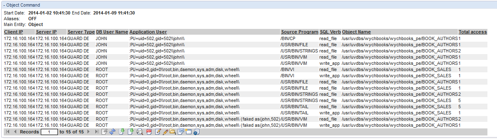

#GuardDETap

The GuardDETap is a Type 1 Guardium STAP for Guardium Data Encryption and Vormetric Data Encryption. Guardium Data Encryption is a file encryption, access control, and auditing product. Unlike Guardium Database Activity Monitoring it can provide thorough and real time auditing capabilities for file access. Guardium is a Database Activity Monitoring System now owned and developed by IBM. Among other things, Guardium monitors, audits, and reports on database transactions.

The GuardDETap is programmed in Ruby and follows the Guardium universal feed protocol explained in [this article](http://www.ibm.com/developerworks/data/library/techarticle/dm-1210universalfeed/index.html) and [this article](http://www.ibm.com/developerworks/data/library/techarticle/dm-1211universalfeed2/index.html). The GuardDETap provides a feed of Guardium/Vormetric DE events to a Guardium Database Activity Monitoring Collector Appliance which collects and reports on the data. The GuardDETap is still under development, but has been shown to forward all simple Guardium/Vormetric DE transactions to a Guardium collector for logging.
##Architecture and Prerequisites
The GuardDETap's architecture consists of a server component that accepts syslog messages from a Guardium/Vormetric DE agent and forwards them to Guardium Collector.

The GuardDETap server uses the Ruby [EventMachine](http://rubyeventmachine.com/) library (for connection/data handling), [protocol buffers](http://code.google.com/p/ruby-protobuf/) (to communicate with the collector), and [bindata](http://bindata.rubyforge.org/) (to build Guardium's wrapper messages).

###GuardDETap Server Prerequisites:
- Ruby 1.9 and above
- The EventMachine gem installed
- The protobuf gem installed
- The bindata gem installed

The GuardDETap was tested with Guardium V9.1, but it seems to work in Guardium V9.0 and V8.2 as well. Other versions of Guardium have not been tried.

##Installing and Starting GuardDETap

Put all of the GuardDETap software on a server and execute:
```
usage: ruby GuardDETap.rb <listen_ip> <collector_ip>
	where:
		<listen_ip> is the IP address of the network interface you want to listen for Syslog Messages on
		<collector_ip> is the IP address of the Guardium Collector to report to
	example: ruby GuardDETap.rb 10.10.9.28 10.10.9.248
```
Next, add the server where the GuardDETap Server is running to the list of Syslog recievers for any Guardium/Vormetric DE agents. The GuardDETap Server will listen on TCP port 514.

##Future Development
The following are some obvious areas for improvement:
- Further testing is likely to be required to support all Guardium/Vormetric DE event types, rather than just those related to file access
- The TapUtils library requires a little bit of work to make it a generic library for building Ruby based STAPs

##Screenshots


##License
The GuardDETapis released under the MIT license. The components that GuardDETap uses (eg: EventMachine, IBM InfoSphere Guardium, Guardium Data Encryption) have their own licenses.

##About the Author
The GuardDETap was developed by John Haldeman as a side project. John currently works as the Security Practice Lead at Information Insights LLC. If you would like to contribute to the GuardDETap, or have any questions about it, you can contact him at john.haldeman@infoinsightsllc.com
